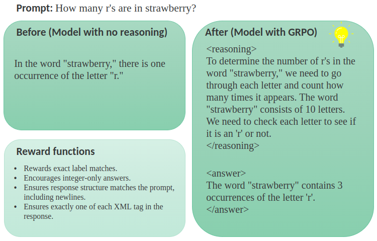

# Learning and Experimenting with LLMs Fine-tuning and Reasoning with Unsloth

> [!IMPORTANT]
> Disclaimer:
> The code has been tested on `Instance type` `g4dn.4xlarge` (Tesla T4. Num GPUs = 1. Max memory: 14.563 GB. Platform: Linux.
> Torch: 2.6.0+cu124. CUDA: 7.5. CUDA Toolkit: 12.4. Triton: 3.2.0)

We want to train a math reasoning model by converting a standard model, such as `Qwen2.5 3B`, into a math reasoning model using [GRPO (Group Relative Policy Optimization)](https://rlhfbook.com/c/11-policy-gradients.html#group-relative-policy-optimization-1), 
a reinforcement learning algorithm that optimizes responses based on reward functions.

Defined the rewarding functions to let the model learn how to reason on them, we fine-tuned `Qwen2.5 3B` on [OpenAI's GSM8K dataset](https://huggingface.co/datasets/openai/gsm8k),
which contains grade school math problems.

The training took `10h` on a `Tesla T4`.
You can find the trained model on [Hugging Face](https://huggingface.co/ugriffo/Qwen2.5-3B-Instruct-Math-Reasoning-GGUF).



## Prerequisites
* Python 3.10+
* GPU supporting CUDA 12.1+
* uv 0.6.10+

### Install uv

Install `uv` with the official installer by following
this [link](https://docs.astral.sh/uv/getting-started/installation/).

## Bootstrap Environment

To easily install the dependencies we created a make file.

### How to use the make file

> [!IMPORTANT]
> Run `Setup` as your init command (or after `Clean`).

* Check: ```make check```
    * Use it to check that `which pip3` and `which python3` points to the right path.
* Setup: ```make setup```
    * Creates an environment and installs all dependencies.
* Tidy up the code: ```make tidy```
    * Run Ruff check and format.
* Clean: ```make clean```
    * Removes the environment and all cached files.

### Additional dependencies

Unsloth attempts to compile `llama.cpp` for `GGUF` model conversion, and it requires:
```
sudo apt-get install pciutils build-essential cmake curl libcurl4-openssl-dev -y
```

## Finetuning the model

We can run the fine-tuning with the following command:
```shell
make finetune
```

## Resources
- `unsloth`:
  - [Wiki](https://github.com/unslothai/unsloth/wiki) 
  - [unsloth notebooks](https://github.com/unslothai/notebooks/)
  - RL:
    - [Train your own R1 reasoning model with Unsloth (GRPO)](https://unsloth.ai/blog/r1-reasoning)
    - [Reinforcement Learning Guide](https://docs.unsloth.ai/basics/reinforcement-learning-guide)
    - [Long-context GRPO](https://unsloth.ai/blog/grpo)
- [Make Llama 3.1 8B talk in Rick Sanchez’s style](https://github.com/neural-maze/neural-hub/tree/master/rick-llm)
- [Reinforcement Learning Pipeline for a Language Model](https://github.com/aburkov/theLMbook/blob/main/GRPO_Qwen_0_5_Instruct.ipynb)
